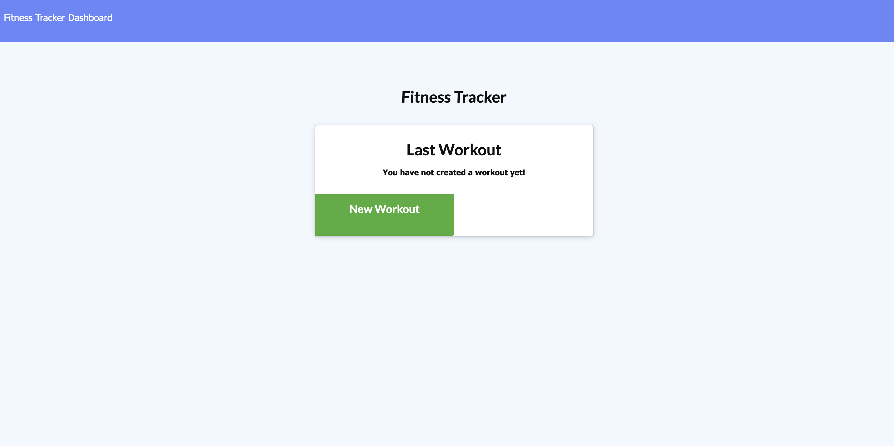

# build-and-burn-tracker
Workout Tracking App

## Description
  node app utilizing MongoDB as the database. 
  ## Table of Contents
  * [License](#license)
  * [Installation](#installation)
  * [Tests](#tests)
  * [Usage](#usage)
  * [Contributing](#contributing)
  * [Questions](#questions)
  ## Installation
  ``` npm install ```
    express
    Mongoose
    MongoDB
    Mongo Atlas for Heroku Deployment
  ## Tests
  ``` npm test ```
  ## Usage
  NA
  ## License
  MIT
  ## Contributing
  Contact me  

## Heroku Deployment
 https://mighty-atoll-78270.herokuapp.com/

  ## ScreenShot
  
